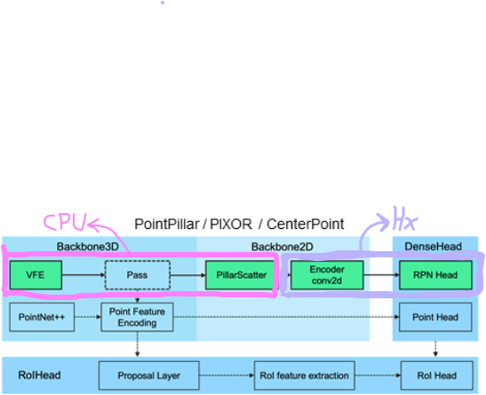

# Intro

This notebook is a minimalistic proof-of-concept showing how a Hailo device can offload the heavy 2D-convolutional part of a point-cloud-input 3D-object-detection network. For this example we use the PointPillars (PP) network from OpenPCDet repo, a modular ecosystem with many 3D networks. The pre/post computation is running in PyTorch using native OpenPCDet code. Almost all of it on CPU, sans the 3D-NMS op which unfortunately is compliled for cuda only. Some of the integration code resides in the openpcdet2hailo_uitls.py. Some integration details, i.e. how we "hook" Hailo into the pytorch model are product of an exploration process of the network as given by OpenPCDet.  See last chapter for an outline of how this has been done, to get a roadmap of how to replicate exploration to other (non-PP) 3D network out of OpenPCdet collection, so that to maximally offload ANY openpcdet 3d-detection net to hailo.

### Final result
Processing a point cloud to get 3D boxes - similar result when executing part of network on Hailo.
Use the jupyter notebook to go through all steps towards this bottom line.
Original result:

Hailo Assisted:

IPython.display.Image('./orig_model_front.png', width=300)
IPython.display.Image('./hailo_assisted_model_front.png', width=300) 

# OpenPCdet - overview
[https://github.com/open-mmlab/OpenPCDet]

### We map to Hailo the 2D backbone and detection head:

The purple bracket marks the part of net we can offload to any Hailo device ("Hx" = H8,H15,..). 
In case of PointPillars, that makes the lion's share of TOPS, as 3D part is minimal.The 3D parts of this and other nets can be Hailo-mapped too, but with a significant task-specific effort required to achieve good efficiency.

# Setup

For the notebook to run properly, please first:

1. Install CUDA and Pytorch. Tested configs:
    a.) torch=1.12.1+cu113 (CUDA 11.3)
    b.) torch=1.12.1+cu102 (CUDA 10.2)
1. Clone & install OpenPCDet: (also consult repo instructions)
   pip install -r requirements
   pip install spconv kornia
   python setup.py develop
   (tested w. commit a68aaa656 04-Apr-23) 
1. Install Mayavi for 3D visualization of point clouds and 3D boxes

Download pretrained PointPillar pytorch model from the link below into <openpcdet-clone-location>:
[https://drive.google.com/file/d/1wMxWTpU1qUoY3DsCH31WJmvJxcjFXKlm/view?usp=sharing]