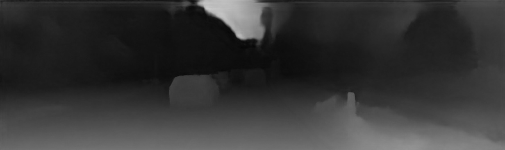

**Stereo Depth Estimation**
===========================
This example demonstrates stereo depth estimation using the HailoRT C++ API with a StereoNet model.
It supports both Hailo-8 and Hailo-8l devices.
The application receives a HEF file and left/right inputs (images, videos, or camera) and produces depth estimation outputs.


## Example

| Left Image | Right Image |
|------------|-------------|
|  |  |

**Output**




Requirements
------------

- HailoRT  
  - For Hailo-8: `HailoRT==4.23.0`  
  - For Hailo-10: `HailoRT==5.1.1`


Supported Models
----------------
- stereonet


Usage
-----
0. Make sure you have installed all of the requirements.

1. Clone the repository:
    ```shell script
    git clone <https://github.com/hailo-ai/Hailo-Application-Code-Examples.git>
        
    cd Hailo-Application-Code-Examples/runtime/hailo-8/cpp/depth_estimation/stereo
    ``` 

2. Compile the project on the development machine  
    ```shell script
    ./build.sh
    ```
    This creates the directory hierarchy build/x86_64 and compile an executable file called stereo_depth_estimation

3. Run the example:

    ```shell script
    ./build/x86_64/stereo_depth_estimation --net <hef_path> --left <image_or_video_or_camera_path> --right <image_or_video_or_camera_path>
    ```

Arguments
---------
- `-n, --net`: 
    - A **model name** (e.g., `yolov8n`) → the script will automatically download and resolve the correct HEF for your device.
    - A **file path** to a local HEF → the script will use the specified network directly.
- ``-l, --left``: Path to the left input (image, folder, video file, or camera).
- ``-r, --right``: Path to the right input (image, folder, video file, or camera).
- `-b, --batch-size`: [optional] Number of images in one batch. Defaults to 1.
- `-s, --save_stream_output`: [optional] Save the output of the inference from a stream.
- `-o, --output-dir`: [optional] Directory where output images/videos will be saved.
- `--camera-resolution`: [optional][Camera only] Input resolution: `sd` (640x480), `hd` (1280x720), or `fhd` (1920x1080).
- `--output-resolution`: [optional] Set output size using `sd|hd|fhd`, or pass custom width/height (e.g., `--output-resolution 1920 1080`).
- `-f, --framerate`: [optional][Camera only] Override the camera input framerate.
- `--list-nets` [optional] Print all supported networks for this application (from `networks.json`) and exit.


Example
-------------------
- List supported networks:
    ```shell script
    ./build/x86_64/stereo_depth_estimation --list-nets
    ```

- List available input resources:
    ```shell script
    ./build/x86_64/stereo_depth_estimation --list-inputs
    ```

- For a video:
    ```shell script
    ./build/x86_64/stereo_depth_estimation --net stereonet.hef --left video_left.mp4 --right video_right.mp4 --batch-size 16
    ```
    Output video is saved as processed_video.mp4

- For a single image:
    ```shell script
    ./build/x86_64/stereo_depth_estimation -n stereonet.hef --left left.jpg --right right.jpg
    ```
    Output image is saved as processed_image_0.jpg

- For a directory of images:
    ```shell script
    ./build/x86_64/stereo_depth_estimation -n stereonet.hef --left left_images --right right_images -b 4
    ````
    Each image is saved as processed_image_i.jpg
    
- For camera, enabling saving the output:
    ```shell script
    ./build/x86_64/stereo_depth_estimation --net stereonet.hef --left /dev/video0 --right /dev/video1  -s
    ```
    Output video is saved as processed_video.mp4

Notes
----------------
- The script assumes that the image is in one of the following formats: .jpg, .jpeg, .png or .bmp 
- When using camera as input:
    - To exit gracefully from openCV window, press 'q'.
    - Camera path is usually found under /dev/video0.
    - Ensure you have the permissions for the camera. You may need to run, for example:
        ```shell script
        sudo chmod 777 /dev/video0
        ```
    - In case OpenCV is defaulting to GStreamer for video capture, warnings might occur.
      To solve, force OpenCV to use V4L2 instead of GStreamer by setting these environment variables:
      ```
        export OPENCV_VIDEOIO_PRIORITY_GSTREAMER=0
        export OPENCV_VIDEOIO_PRIORITY_V4L2=100
      ```
- Using multiple models on same device:
    - If you need to run multiple models on the same virtual device (vdevice), use the AsyncModelInfer constructor that accepts two arguments. Initialize each model using the same group_id. 
    - Example:
      ```
         std::string group_id = "<group_id>";
         AsyncModelInfer model1("<hef1_path>", group_id);
         AsyncModelInfer model2("<hef2_path>", group_id);
      ```
    - By assigning the same group_id to models from different HEF files, you enable the runtime to treat them as part of the same group, allowing them to share resources and run more efficiently on the same hardware.


Disclaimer
----------
This code example is provided by Hailo solely on an “AS IS” basis and “with all faults”. No responsibility or liability is accepted or shall be imposed upon Hailo regarding the accuracy, merchantability, completeness or suitability of the code example. Hailo shall not have any liability or responsibility for errors or omissions in, or any business decisions made by you in reliance on this code example or any part of it. If an error occurs when running this example, please open a ticket in the "Issues" tab.

This example was tested on specific versions and we can only guarantee the expected results using the exact version mentioned above on the exact environment. The example might work for other versions, other environment or other HEF file, but there is no guarantee that it will.
