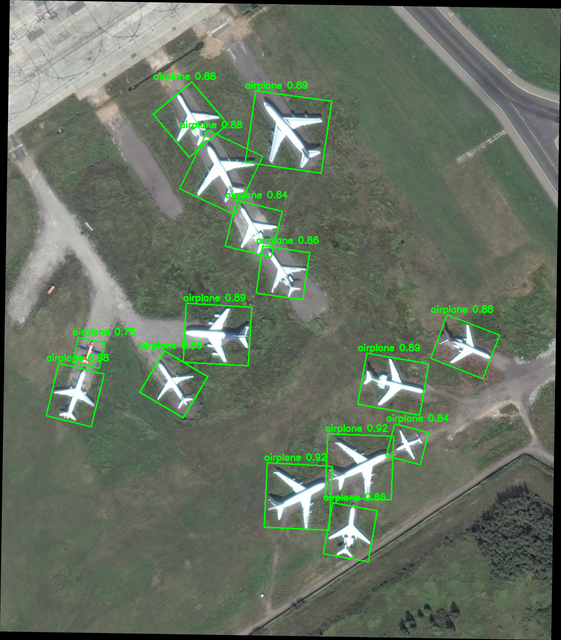

Oriented Object Detection
=========================
This example demonstrates a YoloV11 OBB based oriented object detection model using a Hailo-8, Hailo-8L, or Hailo-10H device.
It receives a HEF and images/video/camera as input, and returns the image\video with annotations of detected objects and bounding boxes.
Oriented object detection extends traditional bounding box detection by adding rotation angle, making it ideal for:
- Aerial/satellite imagery
- Document analysis
- Rotated text detection
- Any scenario where objects may appear at arbitrary angles



Requirements
------------
- HailoRT==4.23.0
- OpenCV >= 4.5.4
    ```shell script
    sudo apt-get install -y libopencv-dev python3-opencv
    ```
- Boost
    ```shell script
    sudo apt-get install libboost-all-dev
    ```
- CMake >= 3.16
- Gtk

Supported Models
----------------
This example currently supports only YoloV11-OBB model.

Usage
-----
0. Make sure you have installed all of the requirements.

1. Clone the repository:
    ```shell script
    git clone <https://github.com/hailo-ai/Hailo-Application-Code-Examples.git>
        
    cd Hailo-Application-Code-Examples/runtime/hailo-8/cpp/oriented_object_detection
    ``` 
2. Compile the project on the development machine  
   ```shell script
    ./build.sh
    ```
   This creates the directory hierarchy build/x86_64 and compile an executable file called obj_det

3. Run the example:

   ```shell script
    ./build/oriented_obj_det --net <hef_path> --input <image_or_video_or_camera_path>
    ```

Arguments
---------

- `-n, --net`: 
    - A **model name** (e.g., `yolov8n`) → the script will automatically download and resolve the correct HEF for your device.
    - A **file path** to a local HEF → the script will use the specified network directly.
- `-i, --input`:
  - An **input source** such as an image (`bus.jpg`), a video (`video.mp4`), a directory of images, or `camera` to use the system camera.
  - A **predefined input name** from `inputs.json` (e.g., `bus`, `street`).
    - If you choose a predefined name, the input will be **automatically downloaded** if it doesn't already exist.
- ``-b, --batch_size (optional)``: Number of images in one batch. Defaults to 1.
- ``-s (optional)``: A flag for saving the output video of a camera input.

Example
-------------------
- List supported networks:
    ```shell script
    ./build/oriented_obj_det --list-nets
    ```
- List available input resources:
    ```shell script
    ./build/oriented_obj_det --list-inputs
    ```

- For a single image:
    ```shell script
    ./build/oriented_obj_det -n yolov11s_obb.hef -i dota_sample.png
    ```
    Output image is saved as processed_image_0.jpg

- For a directory of images:
    ```shell script
    ./build/oriented_obj_det -n yolov11s_obb.hef -i images -b 4
    ````
    Each image is saved as processed_image_i.jpg
    
- For camera, enabling saving the output:
    ```shell script
    ./build/obj_det --net yolov11s_obb.hef --input /dev/video0 --batch_size 2 -s
    ```
    Output video is saved as processed_video.mp4


Notes
----------------
- The script assumes that the image is in one of the following formats: .jpg, .jpeg, .png or .bmp 
- When using camera as input:
    - To exit gracefully from openCV window, press 'q'.
    - Camera path is usually found under /dev/video0.
    - Ensure you have the permissions for the camera. You may need to run, for example:
        ```shell script
        sudo chmod 777 /dev/video0
        ```
    - In case OpenCV is defaulting to GStreamer for video capture, warnings might occur.
      To solve, force OpenCV to use V4L2 instead of GStreamer by setting these environment variables:
      ```
        export OPENCV_VIDEOIO_PRIORITY_GSTREAMER=0
        export OPENCV_VIDEOIO_PRIORITY_V4L2=100
      ```
- Using multiple models on same device:
    - If you need to run multiple models on the same virtual device (vdevice), use the AsyncModelInfer constructor that accepts two arguments. Initialize each model using the same group_id. 
    - Example:
      ```
         std::string group_id = "<group_id>";
         AsyncModelInfer model1("<hef1_path>", group_id);
         AsyncModelInfer model2("<hef2_path>", group_id);
      ```
    - By assigning the same group_id to models from different HEF files, you enable the runtime to treat them as part of the same group, allowing them to share resources and run more efficiently on the same hardware.

Disclaimer
----------
This code example is provided by Hailo solely on an “AS IS” basis and “with all faults”. No responsibility or liability is accepted or shall be imposed upon Hailo regarding the accuracy, merchantability, completeness or suitability of the code example. Hailo shall not have any liability or responsibility for errors or omissions in, or any business decisions made by you in reliance on this code example or any part of it. If an error occurs when running this example, please open a ticket in the "Issues" tab.

This example was tested on specific versions and we can only guarantee the expected results using the exact version mentioned above on the exact environment. The example might work for other versions, other environment or other HEF file, but there is no guarantee that it will.
