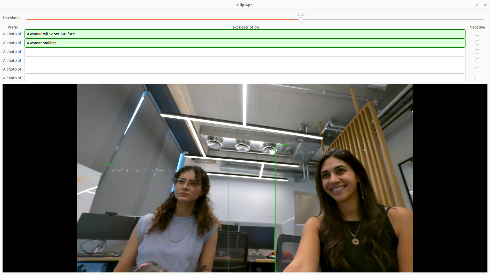
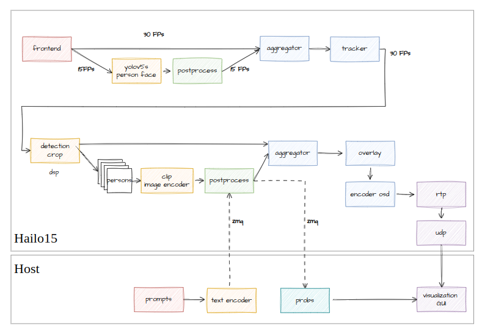

# Clip Application

## Overview
This is an example application to run a CLIP inference on a video in real-time. The image embeddings are accelerated by the Hailo-15 AI processor, while the text embeddings run on the host.  
  


## Requirements
Hailo15 - SBC/EVB is connected and functional.

## How to run
0. **Install system dependencies**
    ```bash
    sudo apt update
    sudo apt install -y libgirepository1.0-dev gobject-introspection python3-gi python3-gi-cairo
1. **Download the files**  
   Download the application files from [here](https://hailo-csdata.s3.eu-west-2.amazonaws.com/clip_example_h15/clip_example.zip) and unzip them:
   ```bash
   unzip clip_example.zip
   cd clip_example/
2. **Run the setup script**  
    This script will copy the necessary files to your SBC and create a virtual environment for CLIP.
    ```bash
    source setup_clip_example.sh
3. **On the host**
    ```bash
    ./clip_host_side.py 
4. **On the H15**
    ```bash
    ~/apps/ai_example_app/clip_example
## Customizing the Clip Application
    


If you want to customize this example, you need to cross-compile the code and copy the executables to the appropriate locations. Follow these steps: 

1. **Modify the Code**   
    You can edit either of the following files:
    - `clip_main.cpp`: This file contains the main application.
    - `clip.cpp`: This file handles the post-processing.

2. **Cross-Compile**  
    Run the script to cross-compile the application:
    `./tools/cross_compiler/cross_compile.py <release|debug> <PATH_TO_TOOLCHAIN>`  
    For example:
    ```bash
    ./tools/cross_compiler/cross_compile.py release /home/hailo_vision_processor_sw_package_2024-10/prebuilt/sbc/sdk/  
3. **Copy the files to H15**  
    After cross-compilation, you will find the files in the following directory: ```armv8a-medialib-test-cases-build-release```  
    Copy the executable and .so files to their respective locations on the H15 device:  

    ```bash
    scp armv8a-medialib-test-cases-build-release/clip/clip_example root@10.0.0.1:/home/root/apps/ai_example_app
    scp armv8a-medialib-test-cases-build-release/clip/libclip_post.so root@10.0.0.1:/usr/lib/hailo-post-processes   
Note: you can add the excutable to any folder in the H15 but the post process have to be in /usr/lib/hailo-post-processes  
For more information, see TAPPAS [documentations](https://github.com/hailo-ai/tappas/blob/daffd36ecab5110d47107255fd7ec4c779758f2e/core/hailo/apps/hailo15/ai_example_app/README.rst#L4).
