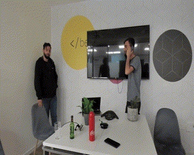
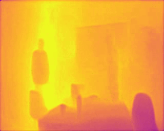

**SCDepthV3 Inference Example**
======================================

This example uses the C++ API of HailoRT to implement a depth estimation inference example. The postprocess is suitable for the scdepth architecture.




The inputs are a compiled network (HEF) file and
a video file (.mp4 or .avi)
The output is a processed depthmap video file (output_video.mp4)

Requirements
------------
HailoRT == 4.18.0

**_NOTE:_** Currently supports only devices connected on a PCIe link.

Usage
-----
1. Download example files:
	```shell script
    ./download_resources.sh 
    ```
2. Compile the project on the development machine  
	```shell script
    ./build.sh
    ```
3. Run the example:

	```shell script
    ./build/depth_estimation_example_cpp --net=scdepthv3.hef --input=input_video.mp4
    ```

The output processed video is saved as **output_video.mp4**

Arguments
---------

- ``-n, --net``: Path to the pre-trained model file (HEF).
- ``-i, --input``: Path to the input image on which object detection will be performed.


Disclaimer
----------
This code example is provided by Hailo solely on an “AS IS” basis and “with all faults”. No responsibility or liability is accepted or shall be imposed upon Hailo regarding the accuracy, merchantability, completeness or suitability of the code example. Hailo shall not have any liability or responsibility for errors or omissions in, or any business decisions made by you in reliance on this code example or any part of it. If an error occurs when running this example, please open a ticket in the "Issues" tab.

This example was tested on specific versions and we can only guarantee the expected results using the exact version mentioned above on the exact environment. The example might work for other versions, other environment or other HEF file, but there is no guarantee that it will.

**Last HailoRT version checked - 4.18.0**
