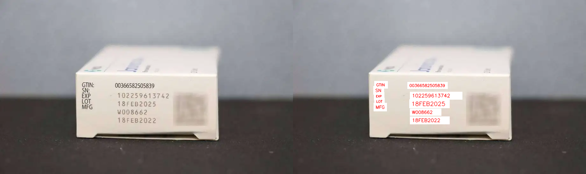

Paddle OCR
================

This example performs end-to-end text detection and recognition using the PaddleOCR pipeline accelerated by a **Hailo8** or **Hailo10H** device.
It processes images, videos, folders, or camera input, detects text regions, and decodes the text using an OCR model.

Optionally, FPS performance can be shown, and output can be saved for each input.



Requirements
------------

- hailo_platform==4.22.0
- loguru
- opencv-python
- paddlepaddle
- shapely
- pyclipper
- symspellpy


Usage
-----
To avoid compatibility issues, it's recommended to have a separate venv from the DFC.

0. Install PCIe driver and PyHailoRT
    - Download and install the PCIe driver and PyHailoRT from the Hailo website
    - To install the PyHailoRT whl:
        ```shell script
        pip install hailort-X.X.X-cpXX-cpXX-linux_x86_64.whl
        ```

1. Clone the repository:
    ```shell script
    git clone <https://github.com/hailo-ai/Hailo-Application-Code-Examples.git>
        
    cd Hailo-Application-Code-Examples/runtime/hailo-8/python/paddle_ocr
    ```

2. Install dependencies:
    ```shell script
    pip install -r requirements.txt
    ```

3. Download example files:

   The script supports both Hailo-8 and Hailo-10 files.  
   Use the `--arch` flag to specify your target hardware:
   ```shell
   ./download_resources.sh --arch 8     # For Hailo-8
   ./download_resources.sh --arch 10    # For Hailo-10
    ```

4. Run the script:
    ```shell script
    ./paddle_ocr.py -n ocr_det.hef,ocr_model.hef -i ocr_img1.jpg
    ```

The output results will be saved under a folder named `output`, or in the directory specified by `--output-dir`.

Arguments
---------

- `-n, --net`: Path to the pre-trained model file (HEF).
- `-i, --input`: Path to the input (image, folder, video file, or `camera`).
- `-b, --batch_size`: [optional] Number of images in one batch. Defaults to 1.
- `-s, --save_stream_output`: [optional] Save the output of the inference from a stream.
- `-o, --output-dir`: [optional] Directory where output images/videos will be saved.
- `--show-fps`: [optional] Display FPS performance metrics for video/camera input.
- `--use-corrector`: [optional] Enable text correction after OCR (e.g., spelling or formatting fixes).
- `-r, --resolution`: [Camera input only] Choose output resolution: `sd` (640x480), `hd` (1280x720), or `fhd` (1920x1080). If not specified, native camera resolution is used.

For more information:
```shell script
./paddle_ocr.py -h
```
Example 
-------
**Inference on single image**
```shell script
./paddle_ocr.py -n ocr_det.hef ocr_model.hef -i ocr_img1.jpg
```

**Inference on a camera stream**
```shell script
./paddle_ocr.py -n ocr_det.hef ocr_model.hef -i camera
```

Additional Notes
----------------

- The example was only tested with ``HailoRT v4.22.0``
- Images are only supported in the following formats: .jpg, .jpeg, .png or .bmp
- Number of input images should be divisible by batch_size
- For any issues, open a post on the [Hailo Community](https://community.hailo.ai)

Disclaimer
----------
This code example is provided by Hailo solely on an “AS IS” basis and “with all faults”. No responsibility or liability is accepted or shall be imposed upon Hailo regarding the accuracy, merchantability, completeness or suitability of the code example. Hailo shall not have any liability or responsibility for errors or omissions in, or any business decisions made by you in reliance on this code example or any part of it. If an error occurs when running this example, please open a ticket in the "Issues" tab.

This example was tested on specific versions and we can only guarantee the expected results using the exact version mentioned above on the exact environment. The example might work for other versions, other environment or other HEF file, but there is no guarantee that it will.
