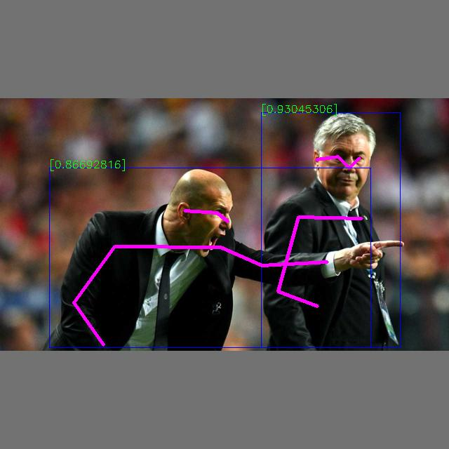

Pose Estimation
================


This example performs object detection using a Hailo8 device.

The example takes an input (image), performs inference using the input HEF file and draws the detection boxes, class type, confidence, keypoints and joints connection on the resized image.  
The example works with .jpg, .jpeg, .png and .bmp image files.  



Requirements
------------

- hailo_platform==4.18.0
- Pillow
- loguru
- numpy
- opencv

Supported Models
----------------

This example expects the hef to contain HailoRT-Postprocess. 

Because of that, this example only supports detections models that allow hailort-postprocess:
- yolov8s


Usage
-----

0. Install PyHailoRT
    - Download the HailoRT whl from the Hailo website - make sure to select the correct Python version. 
    - Install whl:
        ```shell script
        pip install hailort-X.X.X-cpXX-cpXX-linux_x86_64.whl
        ```

1. Clone the repository:
    ```shell script
    git clone <https://github.com/hailo-ai/Hailo-Application-Code-Examples.git>
        
    cd pose_estimation
    ```

2. Install dependencies:
    ```shell script
    pip install -r requirements.txt
    ```

3. Download example files:
    ```shell script
    ./download_resources.sh
    ```

4. Run the script:
    ```shell script
    ./pose_estimation.py -n <model_path> -i <input_image_path> -b <batch_size> -cn <class_num>
    ```

Arguments
---------

- ``-n, --net``: Path to the pre-trained model file (HEF).
- ``-i, --input``: Path to the input image on which object detection will be performed.
- ``-b,`` ``--batch_size``: Number of images in one batch.
- ``-cn, --class_num``: The number of classes the model is trained on. Defaults to 1.


For more information:
```shell script
./pose_estimation.py -h
```
Example 
-------
**Command**
```shell script
./pose_estimation.py -n yolov8s_pose.hef -i zidane.jpg -b 1
```

Additional Notes
----------------

- The example was only tested with ``HailoRT v4.18.0``
- The example expects a HEF which contains the HailoRT Postprocess
- The script assumes that the image is in one of the following formats: .jpg, .jpeg, .png or .bmp
- The annotated files will be saved in the `output_images` folder. 
- The number of input images should be divisible by the batch_size  

Disclaimer
----------
This code example is provided by Hailo solely on an “AS IS” basis and “with all faults”. No responsibility or liability is accepted or shall be imposed upon Hailo regarding the accuracy, merchantability, completeness or suitability of the code example. Hailo shall not have any liability or responsibility for errors or omissions in, or any business decisions made by you in reliance on this code example or any part of it. If an error occurs when running this example, please open a ticket in the "Issues" tab.

This example was tested on specific versions and we can only guarantee the expected results using the exact version mentioned above on the exact environment. The example might work for other versions, other environment or other HEF file, but there is no guarantee that it will.