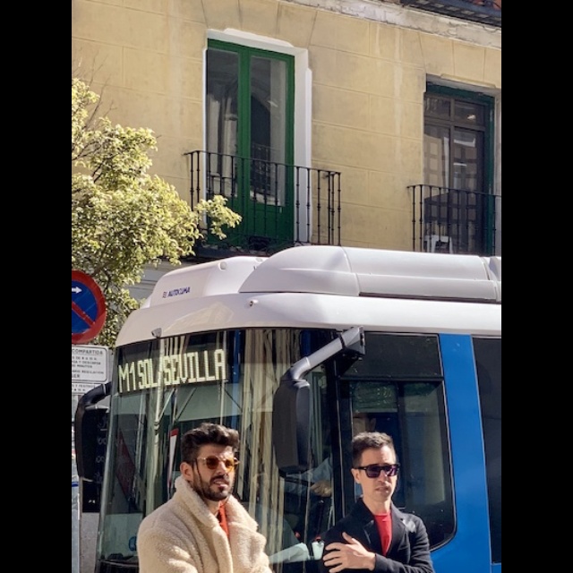

DSP Examples
================
This example demonstrates how to use the Hailo DSP to perform image preprocessing operations. The pipeline consists of three main operations:

1. Crop and Resize with Letterbox:
   - Takes a raw RGB input image
   - Crops the top-left quarter (from (0,0) to (input_width/2, input_height/2))
   - Resizes to 640×640 pixels with letterboxing to maintain aspect ratio

2. Format Conversion:
   - Converts the RGB image to NV12 format

3. Affine Rotation:
   - Takes the NV12 image
   - Applies a 30-degree rotation

The example shows how to chain multiple DSP operations together to create a complete image processing pipeline, from raw RGB input to rotated NV12 output.

    



Requirements
------------

- Hailo15h 
- CMake >= 3.16


Usage
-----
0. Make sure you have installed all of the requirements.

1. Clone the repository:
    ```shell script
    git clone <https://github.com/hailo-ai/Hailo-Application-Code-Examples.git>
        
    cd Hailo-Application-Code-Examples/runtime/hailo-15/dsp_example
    ``` 

2. Download the raw image and copy it to the hailo15:
    ```shell script
    ./download_resources.sh
    scp bus.raw root@10.0.0.1:/home/root
    ```  

3. Source the sdk enviorment
    ```shell script
    source <PATH_TO_SDK>/environment-setup-armv8a-poky-linux
    ```

4. Compile the project on the development machine  
	```shell script
    ./build.sh
    ```
	This creates the directory hierarchy build/x86_64 and compile an executable file called dsp_example

5. Copy the example to the hailo15
	```shell script
    scp ./build/x86_64/dsp_example root@10.0.0.1:/home/root
    ```

6. Run the example on the Hailo15:

	```shell script
    ./dsp_example --input-width 810 --input-height 1080 --output-width 640 --output-height 640 bus.raw
    ```

7. Copy the generated raw images from Hailo15 to your host machine:

    ```bash
    scp root@10.0.0.1:/home/root/cropped_and_resized_image.raw .
    scp root@10.0.0.1:/home/root/affine_rotation_image.raw .
    ```

8. View the generated raw images using the provided conversion script:

    ```bash
    python convert_image.py cropped_and_resized_image.raw --width 640 --height 640 --format rgb
    python convert_image.py affine_rotation_image.raw --width 640 --height 640 --format nv12
    ```

    The script will display the image in a window. Press 'q' to close the window.
    To save the converted image, add the `--save` flag.
	
Arguments
---------

- ``--input-width`` : Width of the input image (in pixels)

- ``--input-height`` : Height of the input image (in pixels)

- ``--output-width`` : Desired width after resize (in pixels)

- ``--output-height`` : Desired height after resize (in pixels)

- ``raw_image_path`` : Path to the raw RGB input image file


Disclaimer
----------
This code example is provided by Hailo solely on an "AS IS" basis and "with all faults". No responsibility or liability is accepted or shall be imposed upon Hailo regarding the accuracy, merchantability, completeness or suitability of the code example. Hailo shall not have any liability or responsibility for errors or omissions in, or any business decisions made by you in reliance on this code example or any part of it. If an error occurs when running this example, please open a ticket in the "Issues" tab.

This example was tested on specific versions and we can only guarantee the expected results using the exact version mentioned above on the exact environment. The example might work for other versions, other environment or other HEF file, but there is no guarantee that it will.
